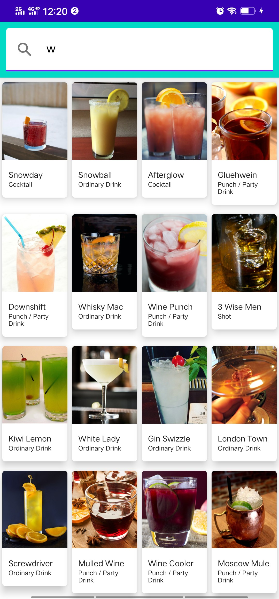

# Compose-Challenge-For-Android-Study-Jam

**A page can search cocktail from an open api by name.**

## Composable：

- SearchAppBar: Row, TextField
- SearchResultContent: LazyVerticalGrid, ItemCard, Column, LinearProgressIndicator
- ItemCard: Card, Column, Image, Text